# 使用ResNet50预置算法训练美食分类模型

## 案例内容介绍

本案例将介绍怎样使用ModelArts数据标注能力和AI Gallery中ModelArts官方发布的`ResNet50（MindSpore版）`算法，训练一个美食分类模型。

ModelArts的AI Gallery有丰富的算法，使用这些算法，无需自己开发训练代码和推理代码，只要准备并标注好数据，就可以轻松快速训练并部署模型。

## 实验目标

1. 掌握从AI Gallery订阅数据集、订阅算法的方法； 
2. 掌握创建训练作业、模型转换、模型部署的方法。

## 实验步骤

### 准备工作

参考[此文档](https://github.com/huaweicloud/ModelArts-Lab/blob/master/docs/ModelArts准备工作/准备工作简易版.md)，完成ModelArts准备工作，包括注册华为云账号、ModelArts全局配置和OBS操作。

### 准备数据

#### 下载数据

本案例的数据集已经发布在AI Gallery，我们从华为云AI Gallery订阅数据集至ModelArts，然后就可以在ModelArts中使用了。

点击[此链接](https://console.huaweicloud.com/modelarts/?region=cn-north-4#/aiMarket/datasetDetail/metadata?content_id=c2b35c4a-20d2-4a3f-a4eb-60f4767b3ecd)进入数据集详情页，点击“下载”按钮，进入下载详情页，如下所示：


其中，目标位置要选择上面 **“准备工作”** 步骤中您自己创建的OBS桶（本文使用的桶名为food--recognition，下文中涉及桶名的地方都需要替换为您自己创建的桶名），点击进入该桶，新建文件夹“food_recognition”，选择该文件夹为目标位置。


## 数据观察

点击[此链接](https://console.huaweicloud.com/modelarts/?region=cn-north-4#/dataset)，进入ModelArts数据集列表，在这里可看到刚才下载的数据集。  


点击数据集名称，进入数据集概览页面，再点击右上角的“开始标注”，然后可以看到如下图所示的数据标注页面：


可以看到，该数据集共包含4类美食，全部都已经进行了标注，类别名如下所示：

```
美食/凉皮,
美食/柿子饼,
美食/灌汤包,
美食/肉夹馍。
```

### 订阅算法

本实验中，我们从AI Gallery订阅ModelArts官方发布的图像分类算法`ResNet50`来训练模型。

点击进入AI Gallery [ResNet50算法(MindSpore)主页](https://marketplace.huaweicloud.com/markets/aihub/modelhub/detail/?id=6b454013-dab9-4028-8c7a-47375067202c)，点击页面右上方的按钮，然后再点击，点击，云服务区域，选择“华为-北京四”，确定，进入算法管理页面。

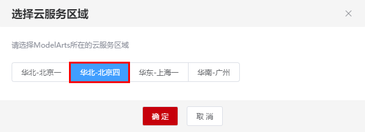

刚进入算法管理页面时，算法会自动进行最新版本的同步，可以点击按钮，刷新状态。当状态变成就绪时，表示同步成功。


### 模型训练

我们使用创建的美食数据集和订阅的图像分类算法，提交一个图像分类的训练作业，训练会生成一个美食分类模型。

### 创建训练作业

接下来回到[ModelArts训练管理页面](https://console.huaweicloud.com/modelarts/?region=cn-north-4#/trainingJobs)，在【训练管理】选择训练作业，点击【创建】，如下图所示：

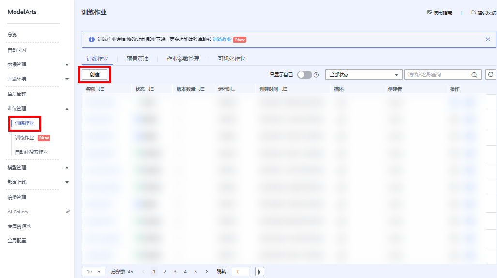

 在创建训练作业页面中选择算法：


选择算法，（算法列表是按订阅时间显示的，找到名称为`图像分类-ResNet50(MindSpore)`的算法，选中它）


计费模式：按需计费

名称：自定义

算法来源：算法管理

算法名称：`图像分类-ResNet50(MindSpore)`

数据来源：数据集

选择数据集和版本：选择刚刚发布的美食数据集及其版本

训练输出：选择 OBS路径`/food-recognition/datasets-food/output/`（注意，桶名“food-recognition”需更换为您自己的桶名，output目录可以通过新建文件夹创建）。训练输出位置用来保存训练生成的模型。


调优参数：用于设置算法中的超参。算法会加载默认参数，但是可以更改和添加参数。调优参数保持默认。


作业日志路径：选择OBS路径（可自行创建一个文件夹存放日志）。

资源池：公共资源池。

规格：Ascend: 1 * Ascend-910(32GB) | ARM: 24 核 96GB。

计算节点个数：选择1，表示我们运行一个单机训练任务。

所有字段填写好之后，确认参数无误，点击“下一步”按钮，然后点击“提交”按钮，开始训练。

### 查看训练结果

训练作业完成后，可以查看训练作业的运行结果。

在训练作业页面，点击作业名称，进入配置信息页面。可以查看到训练作业的详情。


切换到“日志”页签，查看训练作业的训练日志，还可以下载日志到本地查看。

训练日志中会打印一些训练的精度和训练速度等信息。

训练生成的模型会放到训练输出位置OBS路径下，可以直接下载到本地使用。

### 模型转换

使用预置算法训练所得的模型，需通过转换功能，转成适用于Ascend芯片的格式，即“om”格式。

在ModelArts管理控制台，选择“模型管理 > 压缩/转换”。

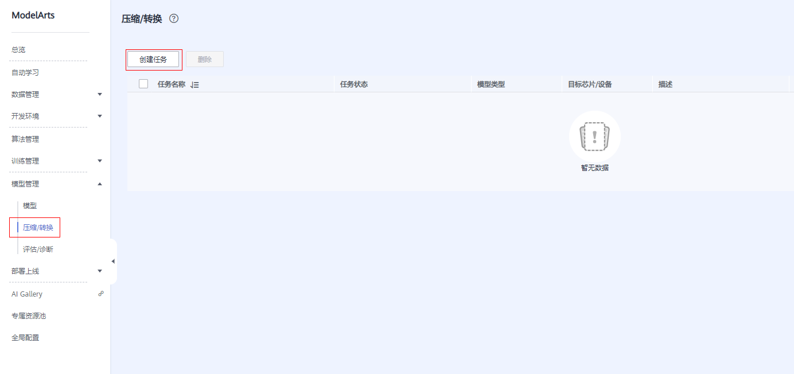

在模型转换作业列表页面，单击“创建任务”。在创建转换任务页面中，参考如下说明填写关键参数。
“输入框架”：选择“TensorFlow”。

“转换输入目录”：请选择训练作业输出路径下的“<输出路径>/V00X/onnx”目录。其中“<输出路径>/V00X”请根据实际参数填写。

“输出框架”：选择“MindSpore”。

“转换输出目录”：请选择训练作业输出路径下的“<输出路径>/V00X/om/model”目录。由于训练作业可以运行多次，产生多个训练作业版本，因此“<输出路径>/V00X”请根据实际参数填写对应训练作业输出的目录及作业版本。

“转换模板”：用于Ascend 310芯片的模型请选择“Onnx-To-Ascend-TBE”模板。更多转换模板及其高级参数介绍请参见[转换模板](https://support.huaweicloud.com/engineers-modelarts/modelarts_23_0110.html)。

“高级选项”：本示例可直接使用参数值如下所示。如果需要修改，请参见转换模板了解参数说明。

“输入张量形状”：“x:1,3,224,224”

“输入数据格式”：“NCHW”(`此处注意，不要填错`)

“转换输出节点”：“446:0”

“优选数据格式”：“5D”

“生成高精度模型”：“0”

“网络输出类型”：“FP32”

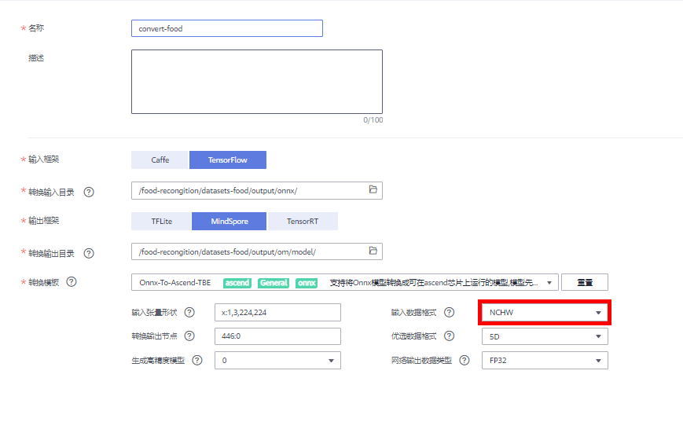

当模型转换的“任务状态”变为“成功”时，表示模型已被转换成“om”格式。（此过程大概需要5分钟）


### 模型部署

#### 导入模型

在ModelArts管理控制台，选择“模型管理 > 模型”。

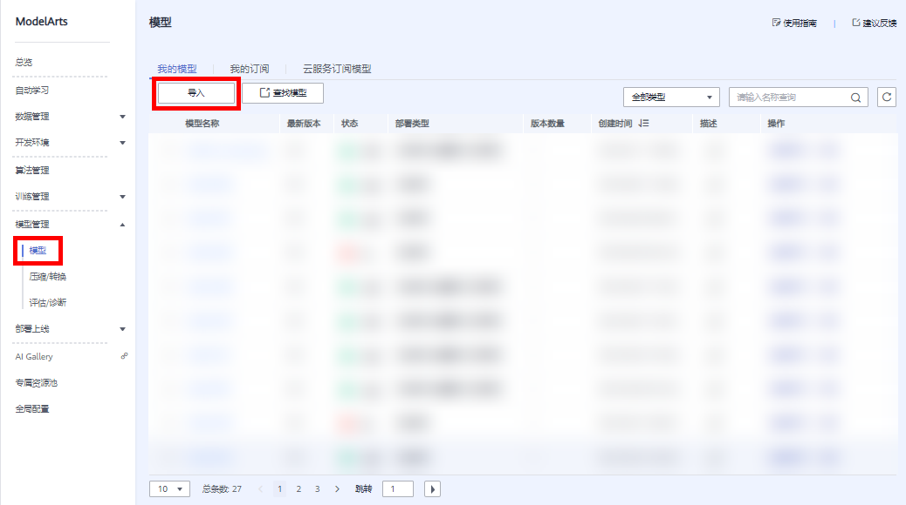

按照如下提示，填写导入模型的字段。

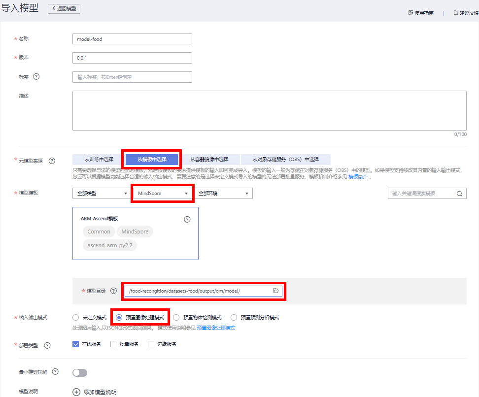

名称：自定义

版本：0.0.1

元模型来源：从模板中选择

模型模板：ARM-Ascend模板

模型目录：选择“模型转换”步骤中“转换输出目录”（例如“<输出路径>/V00X/om/model”目录）

部署类型：默认

输入输出模式：预置图像处理模式

其他参数保持默认。

点击“立即创建”按钮，开始导入模型，等待模型导入成功。

模型导入参数填写完成后，单击“立即创建”。页面自动跳转至模型列表页面，等待模型导入结果。

当模型的状态变为“正常”时，表示模型导入成功。

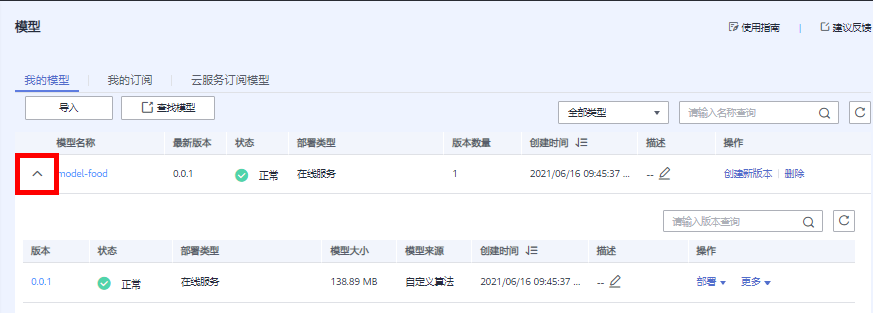

#### 部署上线

等待模型状态为正常，然后点击“部署”下拉框中的“在线服务”，如下图所示：

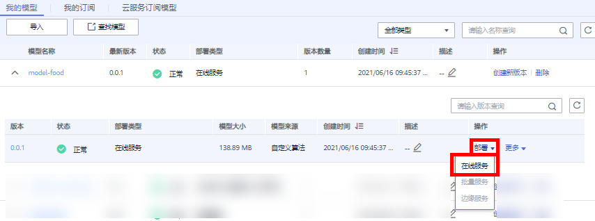

按照如下指导填写参数：

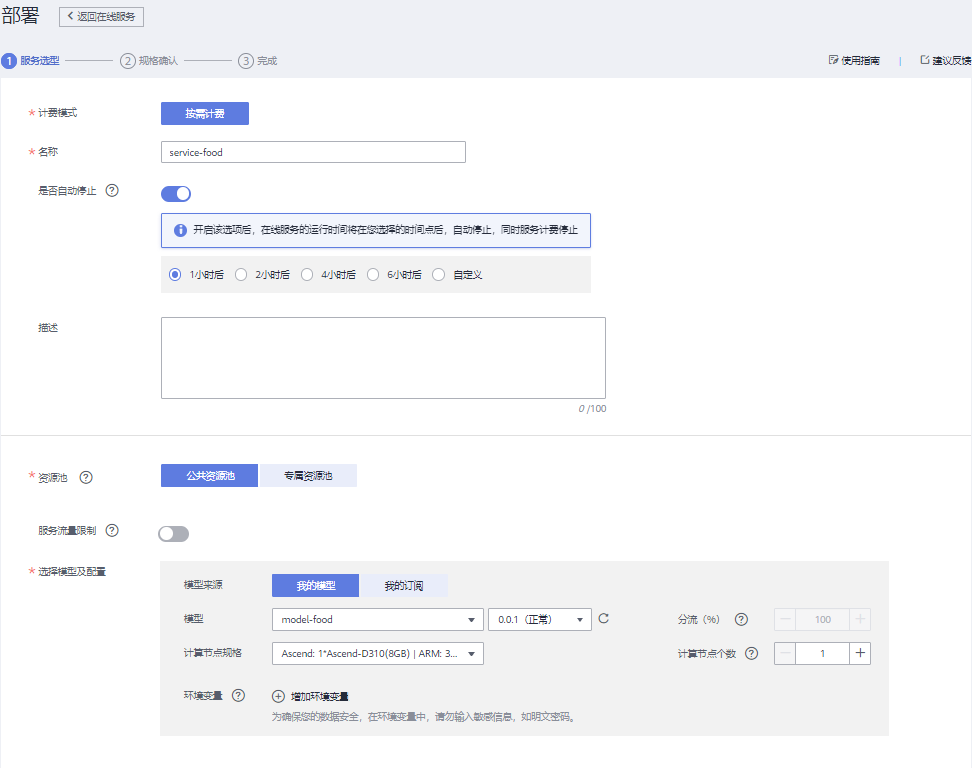

计费模式：按需计费

名称：自定义

是否自动停止：开启，一小时后。会在1小时后自动停止该在线服务。

资源池：公共资源池。

模型来源：我的模型

模型：选择刚刚导入美食分类的模型和版本，会自动加载。

计算节点规格：选择`ARM:3 核 6 GiB Ascend: 1 * Ascend 310`。

计算节点个数：1。如果想要更高的并发数，可以增加计算节点个数，会以多实例的方式部署。

其他参数：默认。

填写好所有参数，点击“下一步”按钮，然后点击“提交”按钮，最后点击查看服务详情。状态栏会显示部
署进度，大概3分钟左右会部署完成。

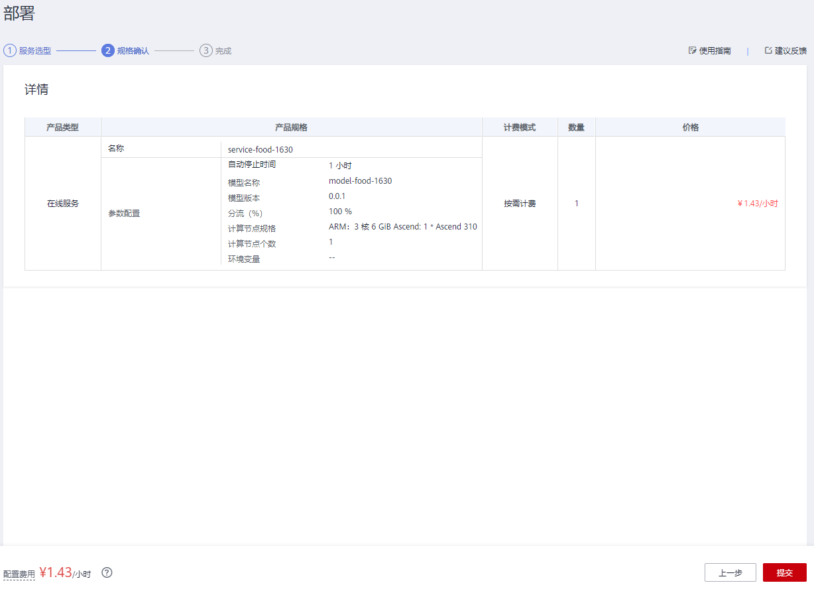

您可以进入“在线服务列表”页面，等待服务部署结束，当服务状态变为“运行中”时，表示服务部署成功。


### 在线服务测试

在线服务的本质是RESTful API，可以通过HTTP请求访问，在本案例中，我们直接在网页上访问在线服务。

点击[此链接](https://modelarts-labs-bj4.obs.cn-north-4.myhuaweicloud.com/end2end/foods_recongition/foods_recongition_test.zip),下载测试图片到本地，解压。

等待在线服务的状态变成运行中。点击”预测“按钮，等待切换到”预测“页签。


切换到“预测”页签。点击上传按钮，上传本地的`test`目录中的图片，然后点击“预测”按钮，进行测试：

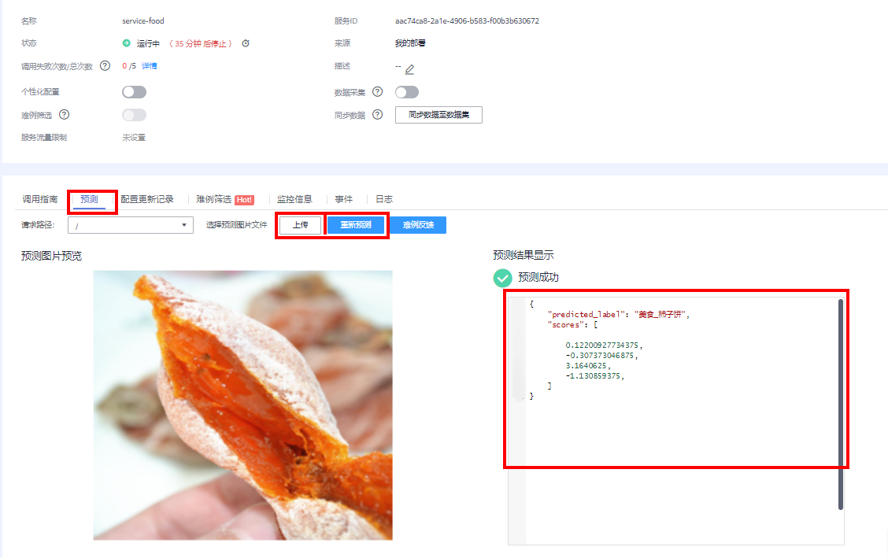

预测结果会出现在右边的输出框

预测结果中的predicted_label字段,表示了预测置信度最高的结果。

预测结果中的scores字段，包含了图片为每种类别的置信度。


### 关闭在线服务

为了避免持续扣费，案例完成后，需要关闭在线服务，点击“停止”按钮即可：


当需要使用该在线服务的时候，可以重新启动该在线服务。

#### 确认关闭所有计费项

点击[此链接](https://console.huaweicloud.com/modelarts/?region=cn-north-4#/manage/dashboard)，进入ModelArts总览页面，如果所有计费中的数字都是0，表示所有计费项都关闭了。


至此，本案例完成。

